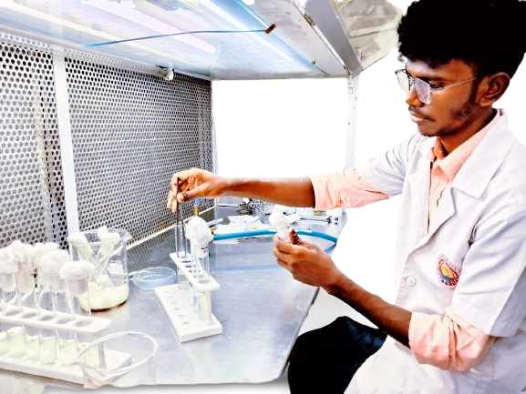

  

  

  
  

  
 

  
  

  

<h1 align="center">🚀 Step into Sham’s Hybrid Universe</h1>

###

👨‍🔬 Half Bioengineer | 💻 Half Tech Nerd | 🔥 100% Curious From cell signals to sensor data — I build systems that think, sense, and solve (●'◡'●)

###

<h1 align="center">✨ About Me</h1>

## ✌️Myself

###

    

###
<h2 align="center">  Myself Sham kumar (●'◡'●)</h2>
<h3 align="center">I’m a Biotechnology student at Prathyusha Engineering College, passionate about combining life sciences with technology. I actively explore areas like smart agriculture, IoT-based automation, and machine learning in biotech applications..</h3> 
<h3 align="center">I started my journey in the world of Biotechnology, driven by curiosity for how life works at a molecular level. Over time, that curiosity expanded into technology — especially where biology meets data, automation, and intelligent systems.  I now explore the intersection of Biotech, IoT, and AI, applying computational thinking to solve real-world biological and agricultural challenges. My work blends science with software — from sensors to code, from labs to cloud.</h3> 

###

<h2 align="center" <h3>"Always learning. Always building. Always evolving"<h3>

&nbsp;&nbsp;&nbsp;&nbsp;&nbsp;

###

<h2 align="center">📜 Quote of the Moment (Magic in every 50 min😉)</h2>

<strong><em>"It's not over until I give up."</em></strong>

<!-- quote-end -->

📈GitHub Performance Overview</h2>

  
  
&nbsp;&nbsp;&nbsp;&nbsp;&nbsp;

  

###
<h2 align="left">My Contributions</h2>
<picture>
  <source media="(prefers-color-scheme: dark)" srcset="https://raw.githubusercontent.com/shamkumar06/shamkumar06/output/pacman-contribution-graph-dark.svg">
  <source media="(prefers-color-scheme: light)" srcset="https://raw.githubusercontent.com/shamkumar06/shamkumar06/output/pacman-contribution-graph.svg">
  
</picture>

###
<h2 align="left">I've experienced with</h2>

###
  

  
  
  
  
  
  
  
  
  
  
  
  
  
  
  
  
  
  
  
  
  
  
  

&nbsp;&nbsp;&nbsp;&nbsp;&nbsp;

## 📫 Contact 

**Email:** [sham8056071949@gmail.com.................](mailto:sham8056071949@gmail.com)  
Available for: **Freelance**, **Collaborations**, **Hackathons**, **Tech Projects**, **Research**

###

<h1>💡 <em>Stay curious.</em> 
🎨 <em>Stay creative.</em> 
💻 <em>Stay coding.</em></h1>

